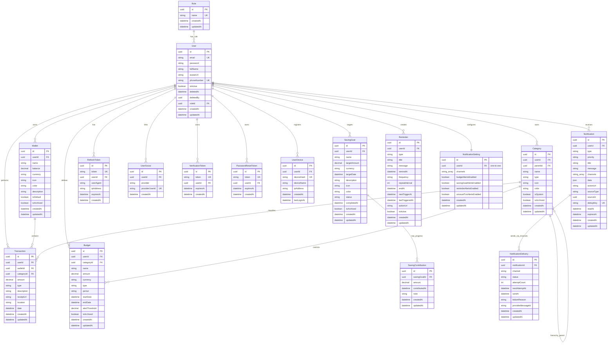

# Tài liệu Kiến trúc Hệ thống FinWise Backend

Tài liệu này mô tả chi tiết kiến trúc phần mềm, cấu trúc dữ liệu (ERD) và các cơ chế bổ trợ của dự án FinWise Backend.

---

## 1. Kiến trúc Phân tầng (Layered Architecture)

FinWise Backend được xây dựng trên kiến trúc phân tầng rõ ràng nhằm đảm bảo tính bảo mật, dễ bảo trì và mở rộng rộng rãi. Luồng xử lý một request chuẩn:

```text
HTTP Request
  ├── 1. Route Layer (Route, Auth, Role middlewares)
  ├── 2. Validation Layer (Zod DTO validation)
  ├── 3. Controller Layer (HTTP handling, response format)
  ├── 4. Service Layer (Business rules, transactions)
  ├── 5. Repository Layer (Prisma Database queries)
  └── Database (PostgreSQL)
```

### Chi tiết các tầng:

*   **Tầng Route (`*.route.ts`)**:
    *   Khai báo các đường dẫn HTTP (methods, paths).
    *   Áp dụng các middleware kiểm soát: `authMiddleware`, `requireRole`, `rateLimitMiddleware` để bảo vệ tài nguyên biên HTTP.
    *   *Không* chứa business logic hoặc Prisma query trực tiếp.
*   **Tầng Validation (`*.validation.ts` / DTO)**:
    *   Sử dụng thư viện **Zod** để kiểm tra và định dạng dữ liệu đầu vào (`req.body`, `req.query`, `req.params`).
    *   Tự động normalize hoặc ép kiểu dữ liệu (coerce) khi cần (ví dụ: chuyển chuỗi ngày tháng sang đối tượng Date, chuyển string số tiền sang chuỗi số chính xác).
    *   Xuất ra kiểu dữ liệu DTO rõ ràng để các tầng tiếp theo sử dụng an toàn.
*   **Tầng Controller (`*.controller.ts`)**:
    *   Tiếp nhận request đã được kiểm tra tính hợp lệ từ validator.
    *   Chuyển tiếp tham số vào tầng Service tương ứng.
    *   Định cấu hình HTTP response (status code, cookies, format JSON).
    *   Bắt lỗi và chuyển lỗi trực tiếp xuống `errorMiddleware` qua hàm `next(error)`.
*   **Tầng Service (`*.service.ts`)**:
    *   Trọng tâm xử lý logic nghiệp vụ (business rules), phân quyền dữ liệu mức dòng (ownership authorization).
    *   Điều phối nhiều repositories hoặc các dịch vụ dùng chung (như MailService, CacheService, LockService).
    *   Quản lý transaction của cơ sở dữ liệu khi cần thực thi nhiều câu lệnh ghi dữ liệu đồng thời bằng `$transaction` của Prisma mức Serializable.
    *   Ném ra `AppError` kèm `ERROR_CODE` thích hợp đối với lỗi nghiệp vụ định trước.
*   **Tầng Repository (`*.repository.ts`)**:
    *   Nơi duy nhất tương tác trực tiếp với cơ sở dữ liệu qua **Prisma Client**.
    *   Thực hiện lọc các trường nhạy cảm trước khi trả về (không làm rò rỉ `password`, `token` nhạy cảm).
    *   Mặc định loại trừ các bản ghi đã bị xóa mềm (`deletedAt IS NOT NULL`) đối với các thực thể liên quan đến người dùng.

---

## 2. Sơ đồ Quan hệ Thực thể (ERD)

Dưới đây là sơ đồ ERD của FinWise Backend mô tả 14 bảng thực thể và mối liên kết, được viết bằng cú pháp Mermaid:



---

## 3. Các Cơ chế Bổ trợ Hệ thống

### 3.1 Cơ chế Caching (`CacheService`)
*   Sử dụng chiến lược kết hợp **Redis Cache** (môi trường sản xuất) và **In-memory cache** làm phương án dự phòng (fallback) tự dọn dẹp khi mất kết nối Redis hoặc môi trường dev không cài đặt Redis.
*   **Áp dụng cho**: Danh mục hệ thống (`categories`), báo cáo tài chính (`reports`).
*   **Chiến lược thu hồi cache (Eviction)**: Khi có bất kỳ hành động thêm/sửa/xóa ví, giao dịch, ngân sách hoặc mục tiêu tiết kiệm, hệ thống tự động quét và thu hồi (delete) cache báo cáo tài chính của người dùng tương ứng bằng cơ chế `clearPattern` để đảm bảo tính thời gian thực của số liệu.

### 3.2 Khóa Phân Phối (`LockService`)
*   Ngăn ngừa việc chạy song song (race conditions) của worker nền khi kiểm tra và gửi thông báo/nhắc nhở định kỳ.
*   Được cài đặt bằng khóa phân phối dựa trên **Redis Lock** (hoặc in-memory lock dự phòng) để đảm bảo chỉ có duy nhất một instance worker thực thi xử lý sự kiện tại một thời điểm trong môi trường multi-instance (Scale out).

### 3.3 Giới hạn tần suất yêu cầu (`Rate Limiting`)
*   Sử dụng middleware `rateLimitMiddleware` dựa trên Redis kết hợp in-memory fallback giúp bảo vệ các endpoint chống tấn công Brute-force hoặc Spam yêu cầu.
*   Tự giải phóng các token lưu trữ in-memory định kỳ để tránh rò rỉ bộ nhớ (memory leak).

### 3.4 Nhật ký hệ thống (`LoggerService`)
*   Tự động ghi nhận log có cấu trúc.
*   Production format: Định dạng **JSON** để dễ dàng thu thập và phân tích bởi ELK, Grafana Loki.
*   Development format: Dạng text có màu trực quan.
*   Tự động phát hiện và ẩn (mask) các thông tin nhạy cảm như `password`, `accessToken`, `refreshToken`, các API keys của AI Assistant trước khi ghi file log hoặc in ra console.
